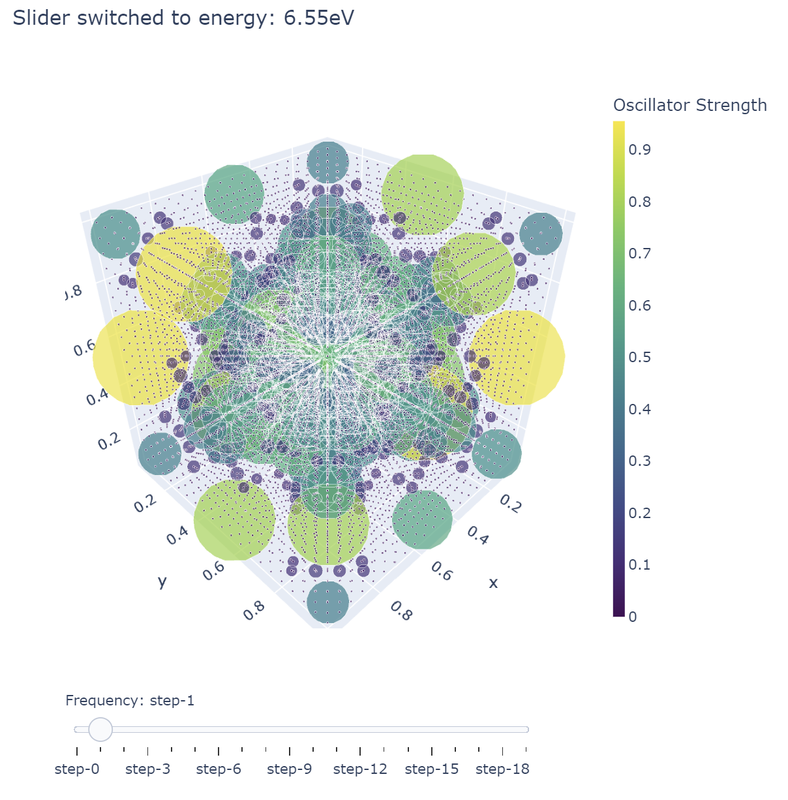

.. VASP K-Point Visualizer Tool documentation master file, created by
   sphinx-quickstart on Wed Jan 24 13:10:06 2024.
   You can adapt this file completely to your liking, but it should at least
   contain the root `toctree` directive.

Welcome to VASP K-Point Visualizer Tool's documentation!
========================================================

.. toctree::
   :maxdepth: 2
   :caption: Contents:

Description
===========
The purpose of the VASP k-point visualizer tool is to create an interactive
three-dimensional reciprocal space plot which displays the k-points in the first Brillouin
zone or paths within it. The tool also displays information about transitions within the
electronic band structure at each k-point depending on the user-inputted transition
energy value within a desired range of error, in units of eV. The plot will alter the size
and color of the k-point depending on the oscillator strength, and display
information about the occupied and unoccupied bands in which the transition occurs. The Γ point on the plot is located at (0.5, 0.5, 0.5). Furthermore, the tool can calculate the imaginary dielectric function ε₂ to help understand where the features in the spectra are coming from in the Brillouin zone. The tool is highly customizable and can be run with a specific range of k-points, bands, and transition energies. The tool requires the OUTCAR and Transmatrix files from VASP as inputs.

Installation
============
The tool requires Python 3, as well as the following libraries:
**numpy**,
**matplotlib**,
**pandas**,
**ipywidgets**,
**Plotly**

Input File Type
===============
OUTCAR file should be in the standard form of output from VASP.

Transmatrix file should be in the following format, with blanks as spacing and not including headers:
**K_weight** **Conduction_Band** **Valence_Band** **Energy_of_Conduction_Band** **Energy_of_Valence_Band** **P_X(Real)** **P_X(Imaginary)** **P_Y(Real)** **P_Y(Imaginary)** **P_Z(Real)** **P_Z(Imaginary)** **Occupation**

Usage
=====
The functions in the tool should be run in the following order:
**Transmatrix** (once),
**Initialize** (once),
**Dielectric**,
**PlotDielectric**,
**Interactiveplot**

Example Output
==============

Indices and tables
==================

* :ref:`genindex`
* :ref:`modindex`
* :ref:`search`
